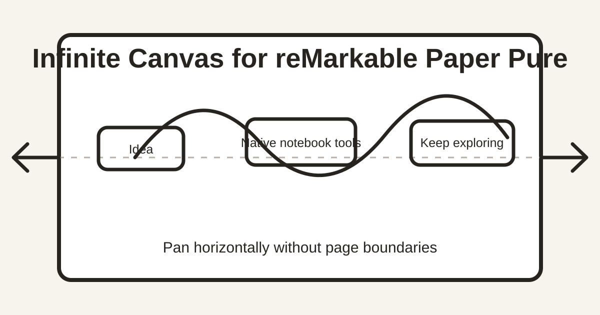

# Infinite Canvas for reMarkable Paper Pure

[](https://github.com/bahadrdsr/remarkable-infinite-horizontal/actions/workflows/ci.yml)
[](https://github.com/bahadrdsr/remarkable-infinite-horizontal/releases/latest)
[](LICENSE)



Add a native horizontal infinite canvas to handwritten notebooks on **reMarkable Paper Pure**. This open-source reMarkable mod keeps the normal notebook toolbar, pens, eraser, selection, layers, undo/redo, storage, and cloud sync.

The project keeps the stock notebook editor, toolbar, pens, eraser, selection, layers, undo/redo, storage, and document sync. It removes the horizontal paper boundary for handwritten notebook pages and prevents horizontal page-swipe/new-page gestures from competing with canvas panning.

## Beginner Windows installation

This is still an unofficial modification, but you do not need to understand C++, Qt, Xovi, or the reMarkable document format.

You need:

- a reMarkable Paper Pure on software `3.28.0.172`;
- developer mode already enabled;
- a verified notebook backup;
- Windows 11 with Ubuntu WSL and Python installed;
- the tablet awake, unlocked, and connected over USB.

Then open PowerShell in the project folder and run:

```powershell
powershell -ExecutionPolicy Bypass -File .\tools\Easy-Install.ps1
```

The guided installer checks prerequisites, downloads the exact official SDK, builds and tests the project, collects the matching tablet resources, installs the mod, and enables guarded startup after reboot. It asks for the tablet SSH password interactively.

See the [Windows quick start](docs/WINDOWS-QUICKSTART.md) for step-by-step instructions and plain-language troubleshooting.

Project website: [Infinite Canvas for reMarkable Paper Pure](https://bahadrdsr.github.io/remarkable-infinite-horizontal/)

## Features

- Native notebook writing speed and tools
- Horizontal panning beyond the original page edges
- Marks outside the original width remain editable and survive editor restarts
- Global default under **Settings > Display settings**
- Per-notebook override under **Notebook settings**
  - Follow global setting
  - Always infinite
  - Always paged
- PDFs and ebooks remain unchanged
- Document sync stays active
- Optional guarded activation after every boot
- Fail-closed recovery to the original stock editor

The canvas is operationally unbounded for normal use. It is not a promise of unlimited numeric precision, storage, or document size.

## Compatibility

The current release is intentionally narrow:

| Device | Software | Codex OS | Qt | Status |
| --- | --- | --- | --- | --- |
| reMarkable Paper Pure (`tatsu`) | `3.28.0.172` | `5.8.203` | `6.10.3` | Tested |

Other devices and firmware versions are rejected before installation. Do not weaken the compatibility checks.

## Installation

Read [Installation](docs/INSTALL.md) before enabling developer mode or changing the tablet.

The short version, after prerequisites and a verified backup:

```powershell
.\tools\Build-Local.ps1
.\tools\Build-Device.ps1
python -m pip install -r .\tools\requirements.txt

# Collect exact stock resources from your tablet.
python .\tools\infinite_horizontal.py capture --approve-shutdown-guard

# Use the inspection path printed by the previous command.
python .\tools\build_native_patch.py .\.local\inspection\<inspection-id> .\.local\patches\current

# Install and start the native patch.
python .\tools\infinite_horizontal.py install --patch .\.local\patches\current
python .\tools\infinite_horizontal.py start --approve-shutdown-guard

# Optional: activate automatically after boot.
python .\tools\infinite_horizontal.py enable-autostart --approve-root-change
```

Passwords are requested interactively and are never accepted as command-line arguments or stored by the project.

## Usage

With the global setting enabled, use two-finger pan/zoom inside any handwritten notebook. Horizontal page swipes and the edge-triggered new-page action are disabled for infinite notebooks. Page overview remains available.

To override one notebook:

1. Open **Notebook settings**.
2. Enable **Override global canvas setting**.
3. Choose **Infinite for this notebook** on or off.
4. Tap the native **Save** button.

The global and per-notebook settings persist across editor restarts and tablet reboots.

## Frequently asked questions

### Does reMarkable Paper Pure have an infinite canvas?

Not in the stock notebook editor. This project adds horizontally unbounded panning to native handwritten notebooks while retaining the original writing tools and notebook data.

### Is this a separate drawing app?

No. It modifies the native reMarkable notebook interface at runtime. Writing latency and tool behavior remain native.

### Does handwriting outside the original page width survive a restart?

Yes. It was verified across notebook close/reopen, a full editor restart, and tablet reboot.

### What happens to horizontal page swipes?

They are disabled while infinite mode is active so they do not open the new-page prompt. Turn infinite mode off globally or for one notebook to restore normal page swipes.

### Can I enable it for only one notebook?

Yes. The global default is in Display settings. Every handwritten notebook can override it from Notebook settings.

### Does it change PDFs and ebooks?

No. PDFs and ebooks keep their normal behavior.

### Does it work on reMarkable 1, reMarkable 2, Paper Pro, or Paper Pro Move?

Not currently. Only Paper Pure software `3.28.0.172` is accepted. Unsupported devices and versions are rejected before installation.

### Can I remove it?

Yes. You can disable the feature from Settings, return the current editor to stock, disable automatic startup, or uninstall completely. See [Recovery and removal](docs/RECOVERY.md).

## Safety and recovery

This project modifies the runtime of proprietary software and is not affiliated with or endorsed by reMarkable.

- Developer mode weakens the device security model and enabling it performs a factory reset.
- Back up and verify your notebooks before installation.
- The installer never modifies notebook data intentionally, but it takes native snapshots before controlled editor transitions.
- Stock boot, vendor service files, kernel, bootloader, and recovery partitions are not replaced.
- Automatic activation is exact-firmware gated, one-shot, bounded, and automatically disables itself after a failed startup.

See [Recovery and removal](docs/RECOVERY.md).

## How it works

The installer collects the exact QML resources from the owner's tablet, verifies their hashes, and generates local replacement resources. Generated stock resources, notebook backups, credentials, and device identifiers are excluded from Git.

At runtime, Xovi and Qt Resource Rebuilder load the verified replacements into the stock editor. A small native settings singleton stores the global default and per-notebook overrides.

See [Architecture](docs/ARCHITECTURE.md).

## Open source

Project code is available under the [MIT License](LICENSE).

Xovi and Qt Resource Rebuilder are downloaded from their upstream releases and are licensed separately under GPL-3.0. They are not committed to this repository. See [Third-party notices](THIRD_PARTY_NOTICES.md).

Contributions are welcome. See [Contributing](CONTRIBUTING.md).
